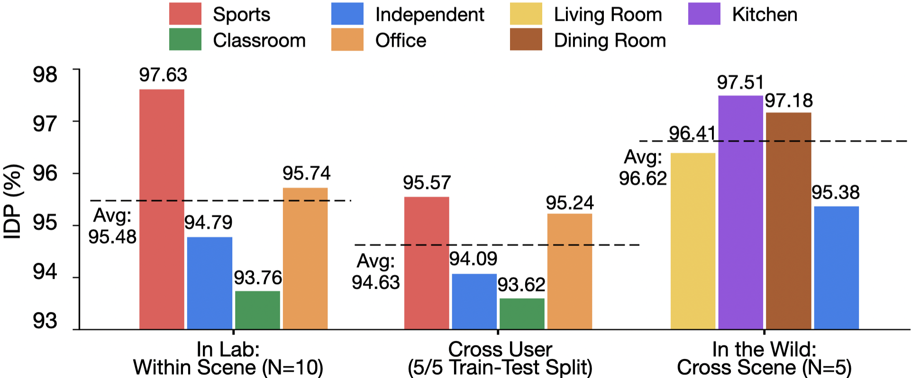
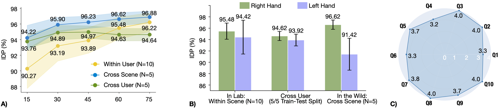

# Invisibility Cloak: Personalized Smartwatch-Guided Camera Obfuscation

Figure 1: Our system consists of a smartwatch app that streams IMU signals and obfuscation requests to an edge device, which runs our user-device association algorithm. This system operates under the following standard security assumptions: all wearable devices are fully compatible with the local camera system, and data on the edge device is secure from unauthorized access and cyber-attacks prior to transmission to the cloud.
<div>
    <h4 align="center">
        Authors:&nbsp
        <a href='https://xueewang.github.io/' target='_blank'>Xue Wang</a>,&nbsp;
        <a href='https://yangzhang.dev/' target='_blank'>Yang Zhang</a>
    </h4>
</div>

<div>
    <h4 align="center">
        <a href="https://hilab-open-source.github.io/InvisibilityCloak/" target='_blank'>
        
        <a href="https://dl.acm.org/doi/10.1145/3746059.3747601" target='_blank'>
        
        </a>
        <a href="https://youtu.be/-UlUI3DfKUE?si=f70wxYkXDia_9Fjn" target='_blank'>
        
        </a>
        <a href="https://drive.google.com/drive/folders/1caPPtjg4dHysmkLXPLz_XsJEdVblDA6h?usp=drive_link" target='_blank'>
        
        </a>
    </h4>
</div>

## Introduction
Cameras are in their golden age due to recent advances in visual AI techniques that significantly extend the applicability and accuracy of vision-based applications including healthcare, entertainment, and security. In public environments, individuals usually have different and changing privacy preferences against their visual information being shared with other entities. To accommodate these varying user needs for visual privacy, we created ***Invisibility Cloak***, a camera obfuscation technique leveraging inertial signals collected from smartwatches to guide an edge device to remove visual information from camera recordings before they are streamed out for cloud-based inferences. Specifically, a smartwatch user can select an obfuscation level that fits their privacy preference in that context and cameras in the environment will use smartwatch signals to identify that user and remove visual information associated with the user. On the conceptual level, our system demonstrates a privacy design rationale which removes information to be shared with a broader internet infrastructure (i.e., cloud) by providing more information to a trusted local camera system (i.e., camera sensor + edge computing device). We developed a custom data-association pipeline and collected data from real-world configurations. Evaluation of our pipeline indicates a user identification accuracy of 95.48% among 10 individuals when our system is provided with only 2 seconds of data.
## Data Collection
#### Synthetic Dataset

Figure 2: *In-Lab* and *In-the-Wild* activity scenes in different environments.
#### Real-World Multi-User Dataset

Figure 3: Multi-user data collection setup and camera views. Round colored stickers on participants’ heads guided our later ground truth annotations. The lower row shows the corresponding camera positions and angles in the room with detected poses and bounding boxes.

## System Evaluation

Figure 3: IDP across the three evaluation configurations. Left: Within-user evaluation results on the In-Lab dataset across four scenarios. Middle: Cross-user evaluation on the In-Lab dataset, trained on data from 5 participants and tested on the remaining 5. Right: Cross-scene evaluation on the In-the-Wild dataset with different activity sets.


Figure 4: A) Effect of window length on user-device association. B) Effect of handedness on user-device association. C) Adjusted SUS Item Scores (0-4 scaled).

## Installation
[Coming Soon]

## Citation
If you find our work useful in your research, please consider citing:
```
@inproceedings{wang2025invisible,
  title={Invisibility Cloak: Personalized Smartwatch-Guided Camera Obfuscation},
  author={Wang, Xue and Zhang, Yang},
  booktitle={Proceedings of the 38th Annual ACM Symposium on User Interface Software and Technology.},
  pages={1--15},
  year={2025}
}
```
## License
This project is licensed under <a rel="license" href="./LICENSE">MIT License</a>. Redistribution and use should follow this license.
